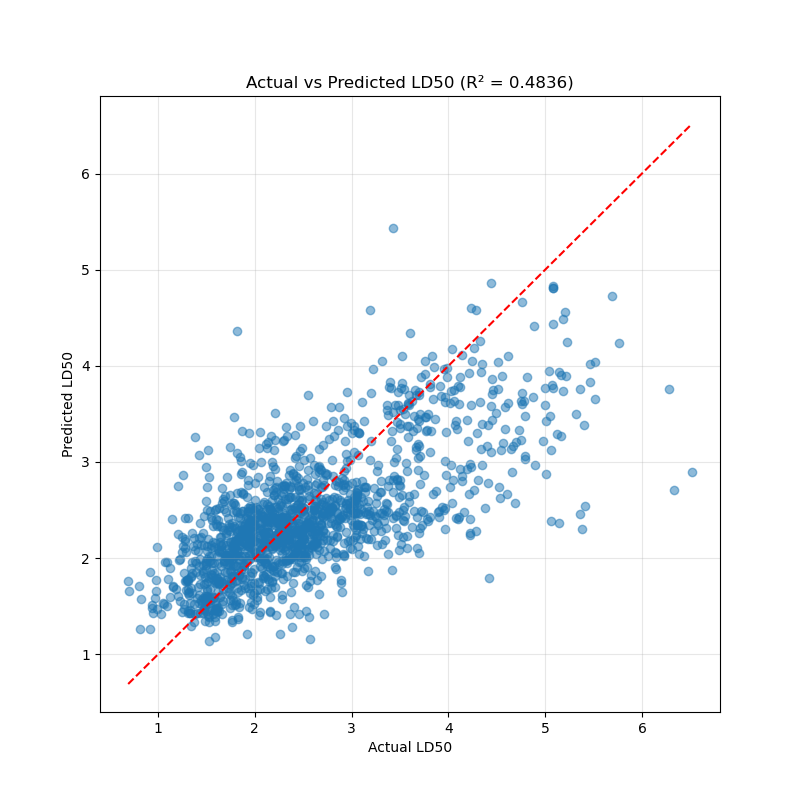
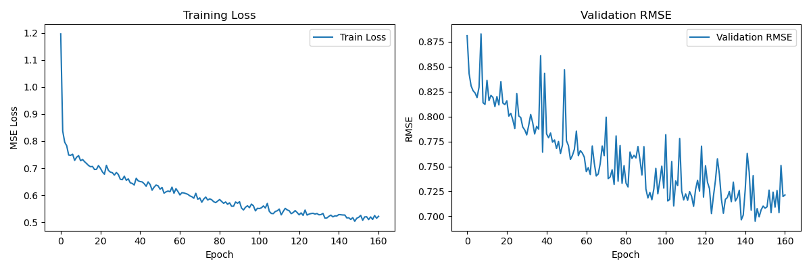

# Drug Toxicity Prediction (LD50)

Predicts acute oral toxicity (LD50) of drug compounds from SMILES strings using Graph Neural Networks. Uses the [TDC LD50_Zhu dataset](https://tdcommons.ai/single_pred_tasks/tox/#acute-toxicity-ld50) (~7,400 compounds).

## Models

- **GAT** (Graph Attention Network) - best results so far (R^2 ~0.52, RMSE ~0.66)
- **GCN** (Graph Convolutional Network) - simpler baseline

Hyperparameter tuning via [Optuna](https://optuna.org/).

## Setup

```bash
pip install -e .
```

Data is automatically downloaded from TDC on first run.

## CLI Usage

### Train a model

```bash
tox-train
tox-train --n-trials 50 --output-dir runs/experiment1
tox-train --device cuda --max-epochs 300 --patience 20
```

### Predict on new compounds

```bash
tox-predict --model-path toxicity_model.pt --smiles "CC(=O)OC1=CC=CC=C1C(=O)O" "C1=CC=CC=C1"
tox-predict --model-path toxicity_model.pt --input-file compounds.csv --smiles-col SMILES --output-file results.csv
```

### Run TDC benchmark

```bash
tox-evaluate
tox-evaluate --seeds 1 2 3 4 5 --n-trials 30
```

## Project Structure

```
tox_prediction/                    # Installable Python package
  features.py                      # SMILES to graph conversion (56-dim node features)
  models.py                        # GCNNet, GATNet, save/load
  data.py                          # TDC data loading, DataLoader creation
  training.py                      # Training loop, Optuna HPO
  predict.py                       # Inference on new SMILES
  evaluate_tdc.py                  # TDC ADMET benchmark runner
  plotting.py                      # Learning curves, actual-vs-predicted scatter
  cli/                             # CLI entrypoints
    train_cmd.py                   # tox-train
    predict_cmd.py                 # tox-predict
    evaluate_cmd.py                # tox-evaluate
pyproject.toml                     # Package config

# Legacy scripts (kept for reference)
drug_toxicity_prediction_v3.py     # Previous main script
toxicity-predictor.py              # Random Forest baseline
drug_pred_v1/                      # Earlier GNN iteration
goodGATrun/                        # Best GAT run (v2)
old_GNN/                           # Initial GNN attempt
tdc_eval/                          # Previous TDC eval script
```

## Results





## Best Hyperparameters Found

| Parameter | Value |
|-----------|-------|
| Model | GAT |
| Hidden channels | 64 |
| Layers | 3 |
| Attention heads | 8 |
| Dropout | 0.2 |
| Learning rate | 0.002 |
| Batch size | 128 |
